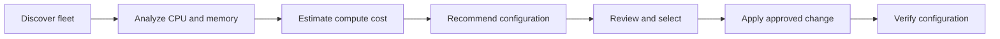
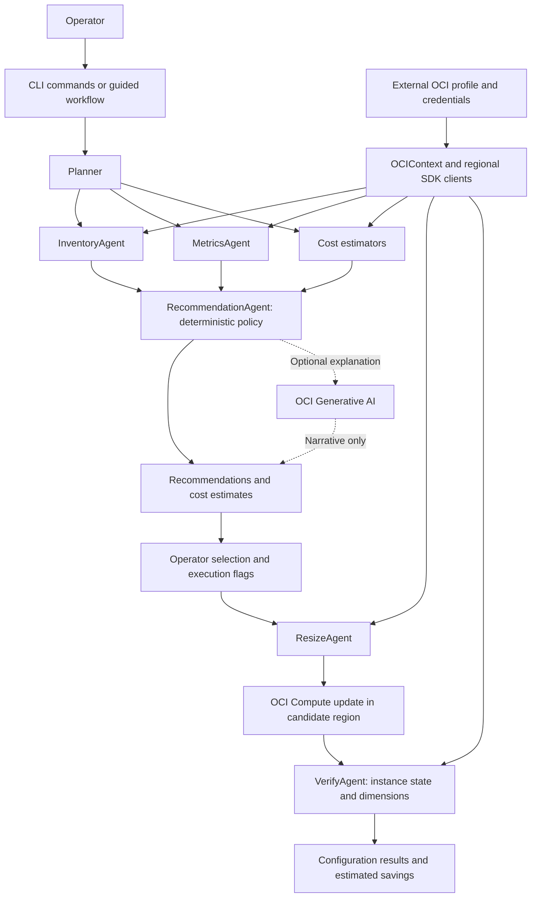
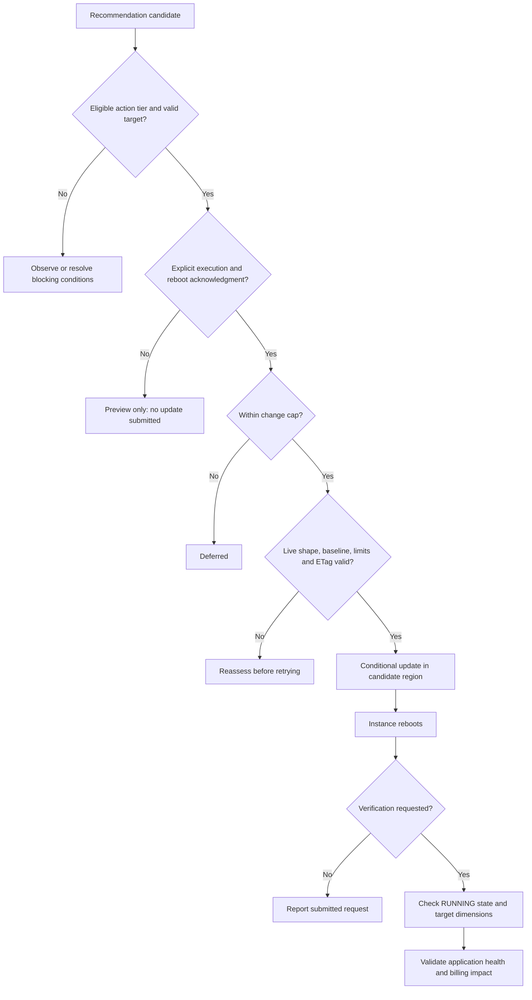

# OCI Right-Sizer

OCI Right-Sizer helps customers assess Compute workloads, identify sizing opportunities, and review the estimated financial impact before making changes. It combines OCI inventory, CPU and memory telemetry, shape limits, and pricing in one Python CLI.

Start with `scan` and `recommend`. These commands do not modify instances. Execution is optional and requires explicit approval flags. Resizing a running instance reboots it, so use an approved maintenance window and validate the application afterward.

Recommendations combine utilization, metric coverage, shape constraints, and estimated compute costs. Your maintenance and application requirements guide the final resize decision.

## How it works



Assessment produces recommendations and estimated savings before execution. After a resize, the tool verifies the instance state and target configuration; you then check application health and the actual billing impact.

## Architecture

One CLI coordinates the analysis and execution components inside `rightsizer.py`. OCI IAM controls the service access available to your selected identity.



Generative AI is optional. It supplies explanations and summaries; deterministic code controls eligibility, dimensions, and savings calculations.

## What it does

| Command | Purpose | Changes instances? |
| --- | --- | --- |
| `scan` | Portfolio view of estimated savings in a compartment subtree | No |
| `recommend` | Per-instance recommendations, rationale, coverage, and action tiers | No |
| `apply` | Preview eligible execution candidates; submit only with `--apply` | Only with `--apply` |
| `run` | Assessment with optional execution and configuration verification | Only with `--apply` |
| `interactive` or no command | Guided assessment and selection, followed by a separate confirmation | Only after confirmation |

The default scope is the configured OCI region. An omitted compartment means the accessible tenancy-root scope for assessment. Use an explicit compartment and region for your first run. `--regions all` explicitly expands a fleet assessment to subscribed regions.

Automatic execution is limited to **Standard and Optimized Flex VMs**. DenseIO, bare metal, GPU, and fixed shapes are excluded. Live OCI shape limits are checked before submission; unresolved limits, an invalid target, a missing ETag, or changed baseline dimensions block the request.

## 1. Install

Use Python 3.10 or later. Download this repository from GitHub, or clone it:

```sh
git clone https://github.com/subhanchaudry/oci-rightsizer.git
cd oci-rightsizer
python3 -m venv .venv
. .venv/bin/activate
python -m pip install -r requirements.txt
python rightsizer.py --version
python rightsizer.py --help
```

The only direct runtime dependency is the OCI Python SDK. Cloud operations require network access to the relevant OCI APIs. Public list pricing also needs access to Oracle's pricing endpoint; dependency installation needs access to PyPI.

## 2. Configure authentication

### Local API-key profile

Configure an OCI SDK profile outside this repository using the [OCI configuration guide](https://docs.oracle.com/en-us/iaas/Content/API/Concepts/sdkconfig.htm). If the OCI CLI is installed, `oci setup config` can create it. Keep the private key and configuration in your user-owned OCI directory, with restricted file permissions.

```sh
python rightsizer.py --profile DEFAULT --auth api_key --region us-ashburn-1 scan \
  --compartment-id '<compartment_ocid>' --no-pricing
```

### OCI Cloud Shell

Open Cloud Shell in the intended tenancy and region, then download or clone the repository and install its dependency. Cloud Shell supplies the configuration location and profile through `OCI_CLI_CONFIG_FILE` and `OCI_CLI_PROFILE`, and uses delegated authentication. The script honors these variables and builds an explicit delegated signer. Do not copy Cloud Shell tokens into the repository.

```sh
python3 rightsizer.py --auth instance_obo_user scan \
  --compartment-id '<compartment_ocid>' --no-pricing
```

Cloud Shell's current profile must contain `delegation_token_file`. Repository download and installation may require the [Cloud Shell public network](https://docs.oracle.com/en-us/iaas/Content/API/Concepts/cloudshellintro.htm). See [Cloud Shell configuration](https://docs.oracle.com/en-us/iaas/Content/API/Concepts/devcloudshellgettingstarted.htm).

### Session-token profile

An OCI CLI session-authentication profile can be used with `--auth security_token`. It must contain `security_token_file`, `key_file`, `tenancy`, and `region`. Refresh an expired session with the OCI CLI before starting a new run. Session files remain outside the repository.

`--auth auto` is the default. It honors `OCI_CLI_AUTH`, then detects delegation or security-token entries in the selected profile, and otherwise uses API-key authentication. Supported modes are `api_key`, `security_token`, and `instance_obo_user`. Instance and resource principal authentication are not supported.

Global options such as `--profile`, `--config-file`, `--auth`, `--region`, and `--output` go **before** the command.

## 3. Grant scoped IAM access

Have a tenancy administrator review policies against your identity domain and compartment structure. Use a reader identity for assessment, and grant update permission separately to operators authorized to resize. The following statements are examples; replace the group and compartment names. For identity-domain groups, use the domain-qualified group name required by your tenancy.

Assessment access:

```text
Allow group RightSizerReaders to inspect compartments in tenancy
Allow group RightSizerReaders to inspect tenancies in tenancy
Allow group RightSizerReaders to read instances in compartment Workloads
Allow group RightSizerReaders to read metrics in compartment Workloads where target.metrics.namespace = 'oci_computeagent'
```

The compartment scope includes accessible descendants. Apply matching permissions to the workloads you intend to assess. Some tenancy metadata queries need tenancy-level access; an inaccessible workload must not be treated as a zero-cost workload.

Optional effective billing-rate access:

```text
Allow group RightSizerReaders to read usage-report in tenancy
```

This grants access to sensitive billing information at tenancy scope. Use `--pricing-source list` to avoid requesting billed usage, or `--no-pricing` to omit estimates, when that access is unsuitable.

Execution access, in addition to assessment permissions:

```text
Allow group RightSizerOperators to {INSTANCE_INSPECT, INSTANCE_READ, INSTANCE_UPDATE} in compartment Workloads
```

`INSTANCE_UPDATE` permits instance updates beyond this tool's shape changes. Scope the operator group and compartment accordingly. The tool does not require permission to create or terminate instances. OCI IAM remains the authorization boundary; action tiers are recommendation heuristics, not a substitute for IAM or your change process.

References: [Compute permissions](https://docs.oracle.com/en-us/iaas/Content/Identity/Reference/corepolicyreference.htm), [Monitoring permissions](https://docs.oracle.com/en-us/iaas/Content/Identity/policyreference/monitoringpolicyreference.htm), and [Cost Analysis and Usage API access](https://docs.oracle.com/en-us/iaas/Content/Billing/Concepts/costanalysisoverview.htm).

## 4. Enable instance telemetry

The tool queries `CpuUtilization` and `MemoryUtilization` in `oci_computeagent`. Enable the **Compute Instance Monitoring** plugin in Oracle Cloud Agent for each workload, and confirm that both metrics are visible in OCI Monitoring.

The default policy uses a 24-hour short window for sustained pressure and a 14-day long window for downsizing. Downsizing requires at least seven observed days and at least 50% coverage of the inferred active window for that axis. Active time is inferred from metric timestamps, not proven from a workload schedule. Missing or sparse telemetry blocks the corresponding reduction; missing short-window CPU or memory prevents automated execution. Do not shorten the evidence window merely to obtain savings candidates.

See [enabling Compute monitoring](https://docs.oracle.com/en-us/iaas/Content/Compute/Tasks/enablingmonitoring.htm) and [Compute metrics](https://docs.oracle.com/en-us/iaas/Content/Compute/References/computemetrics.htm).

## 5. Assess and review

Assess one compartment in the configured region:

```sh
python rightsizer.py --profile DEFAULT --region us-ashburn-1 scan \
  --compartment-id '<compartment_ocid>'

python rightsizer.py --profile DEFAULT --region us-ashburn-1 recommend \
  --compartment-id '<compartment_ocid>'
```

Review one instance using its actual region:

```sh
python rightsizer.py --profile DEFAULT --region us-ashburn-1 recommend \
  --instance-id '<instance_ocid>'
```

For a fleet spanning regions, use `--regions us-ashburn-1,us-phoenix-1`. Resize and verification route each candidate to its recorded region. For a single-instance command, `--region` selects the endpoint; `--regions` does not locate an instance automatically.

| Action tier | Meaning |
| --- | --- |
| `AUTO_APPLY` | Meets deterministic eligibility checks; still needs explicit execution and maintenance approval |
| `REVIEW_REQUIRED` | Human review required, for example production-like tags, scale-up, sparse data, or unavailable pricing |
| `OBSERVE` | No executable recommendation or blocking evidence/validation issue |

Production tagging is a heuristic. Untagged production workloads may still appear in `AUTO_APPLY`. Review dependency, database, licensing, network-bandwidth, VNIC, backup, and recovery requirements before resizing.

To save detailed output locally:

```sh
umask 077
mkdir -p reports
python rightsizer.py --output json recommend \
  --compartment-id '<compartment_ocid>' > reports/recommendations.json
```

Reports contain operational information. Review and sanitize them before sharing. The script writes to stdout; file creation and access protection are controlled by your shell.

## 6. Preview and execute a bounded change

The execution path checks both the recommendation and the live instance before submitting a change:



Preview execution eligibility first; this submits nothing:

```sh
python rightsizer.py --region us-ashburn-1 apply \
  --instance-id '<instance_ocid>'
```

During an approved maintenance window, explicitly submit and verify one eligible change:

```sh
python rightsizer.py --region us-ashburn-1 apply \
  --instance-id '<instance_ocid>' \
  --apply --acknowledge-reboot --max-changes 1 --wait
```

The default execution tier is `auto` and the default cap is one change. To include a reviewed candidate, explicitly add `--apply-tier review`. `--apply-tier all` also excludes `OBSERVE`; it cannot override validation errors. Execution requires an explicit instance or compartment scope, a reboot acknowledgment, and a running instance. `--max-changes 0` submits nothing.

`apply` recomputes recommendations; it does not replay an immutable saved approval plan. It compares live baseline dimensions and shape immediately before updating, then uses the instance ETag for a conditional update. If the workload changes, reassess it. A compartment cap selects the highest-ranked eligible candidates, so prefer a specific instance when approving a specific workload.

`--wait` checks that OCI reports `RUNNING` with the requested OCPUs and memory. It does **not** check application availability, latency, database health, or measured billing savings. Perform those checks separately. There is no automatic rollback. Record the original configuration and agree on a recovery procedure before execution.

The guided workflow respects supplied region/compartment scope, retains the minimum evidence-day requirement, and requests a separate confirmation after workload selection. It submits at most one change per guided run.

See [Oracle's resize considerations](https://docs.oracle.com/en-us/iaas/Content/Compute/Tasks/resizinginstances.htm) for reboot, image, capacity, networking, and recovery considerations.

## Pricing and optional GenAI

Pricing is attempted by default. `auto` prefers effective historical billed rates and falls back to public list pricing. `effective` and `list` select a source explicitly. `--pricing-currency` selects a currency; `--pricing-catalog` supplies an operator-maintained JSON catalog. Unavailable pricing is shown as unavailable, and recovered lookup diagnostics remain in developer output.

Savings are **estimated monthly compute run-rate differences**, using 730 hours by default. They do not establish realized billing savings, complete TCO, workload performance equivalence, or future negotiated rates. Storage, network transfer, licensing changes, commitments, workload schedules, and application constraints need separate review. The JSON `realization_summary` field is retained for compatibility and includes an explicit estimate basis.

GenAI is off by default. `--use-genai` with `--genai-model-id` and `--genai-compartment-id` requests an optional OCI Generative AI explanation. The model must support the SDK generic chat request in the configured region and use an on-demand model OCID beginning `ocid1.generativeaimodel.`; dedicated endpoints are not supported. Confirm model access and the required [Generative AI IAM policy](https://docs.oracle.com/en-us/iaas/Content/generative-ai/iam-policies.htm) before enabling it.

Optional prompts include selected instance identifiers, sizing, metric summaries, recommendations, resource names, and financial summaries. They do not include the OCI configuration, private keys, or tokens. Review this data flow against your organization's requirements. Model output may explain a recommendation but cannot change deterministic dimensions, eligibility, or savings. GenAI failures are non-blocking.

## Troubleshooting

| Symptom | Check |
| --- | --- |
| SDK missing | Activate the environment and install `requirements.txt` |
| Authentication or authorization failure | Profile, auth mode, token expiry, IAM, region, and connectivity |
| No memory telemetry | Oracle Cloud Agent plugin, metric visibility, and Monitoring permissions |
| `OBSERVE` or blocked resize | Evidence days, coverage, supported shape, live limits, and validation messages |
| Candidate fails outside the current region | Use its actual region for single-instance commands; fleet execution uses recorded regions |
| Conditional update rejected | Instance changed after assessment; reassess before retrying |
| Pricing unavailable | Billing permissions, selected source/currency, public-network access, or local catalog format |
| Verification timeout | Inspect the instance in OCI, then check guest/application health; avoid blind resubmission |

Exit codes: `0` for successful processing, `1` for operation/verification failures or incomplete fleet scope, `2` for invalid arguments, and `130` for interruption. JSON `scope_complete: false` marks a partial fleet assessment, including one that reaches an explicit instance limit. Fleet execution is blocked until scope completeness is restored; a separately assessed single instance can still be handled. Inspect warnings and JSON error rows. SDK signed-request debug output is suppressed; `--developer-details` adds operational detail and should remain private.
